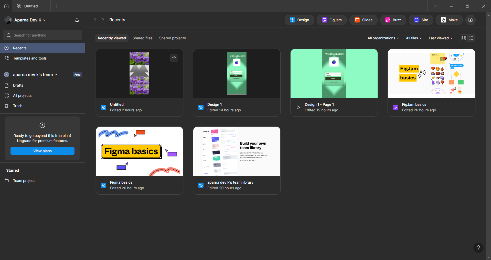

# Task 1: Figma Installation

## 📌 What is this task?

This task is about installing **Figma**, a tool used to design user interfaces and user experiences (UI/UX).

---

## 🛠️ Steps I Followed

1. Went to [figma.com](https://www.figma.com/)
2. Signed up with my email (created a free account)
3. Downloaded the Figma app for Windows
4. Installed the app
5. Opened Figma and created a new design file

---

## 📸 Screenshot

Here is a screenshot of Figma after installation:

---

## ✅ Task Completed

Figma is installed and ready to use for upcoming design tasks.
