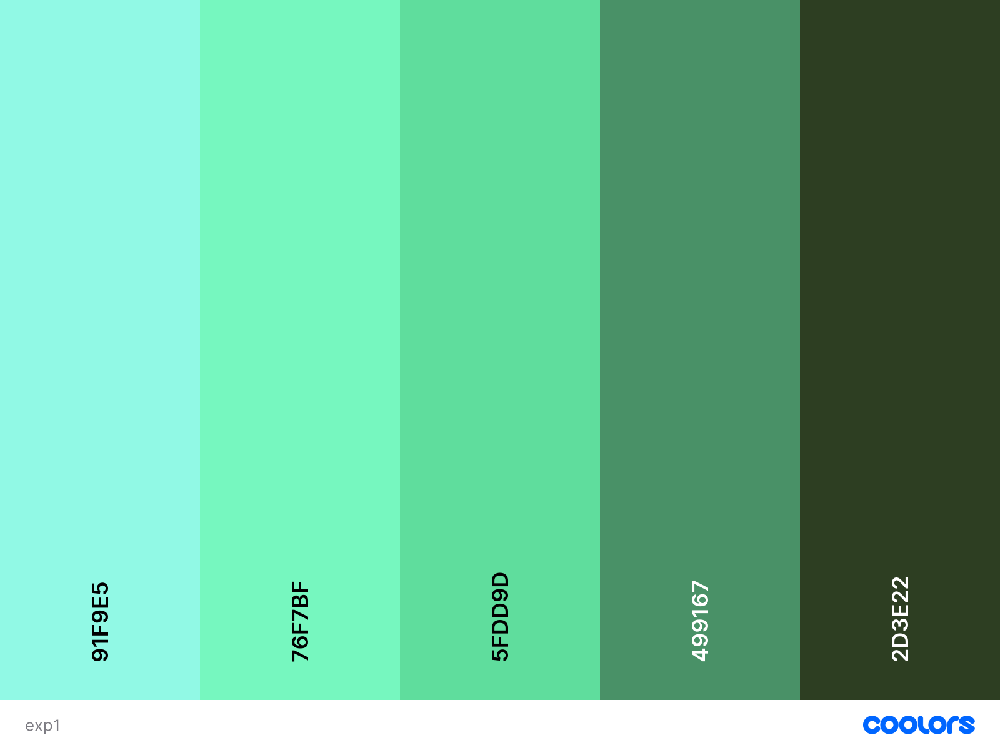
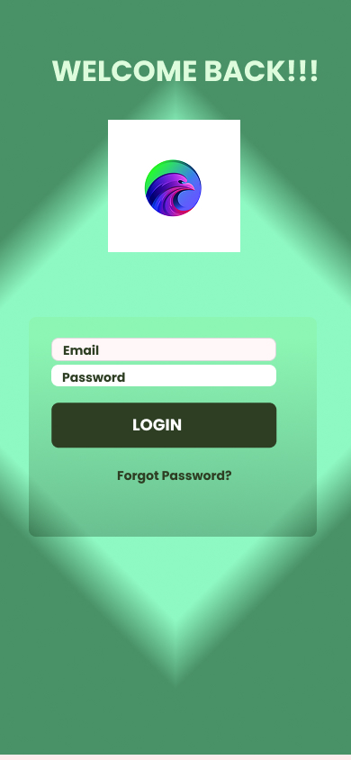

# Task 2: Color Palette and Redesign

## 📌 What is this task?

In this task, I created a custom color palette and applied it to a UI design using **Figma**.

---

## 🎨 My Color Palette

I used [Coolors](https://coolors.co/) to generate this palette:

| Color Role   | HEX Code | Example Use         |
|--------------|----------|---------------------|
| Light Aqua   | #91F9E5  | Background          |
| Mint Green   | #76F7BF  | Buttons / Highlights|
| Fresh Green  | #5FDD9D  | Primary Buttons     |
| Teal Green   | #499167  | Text / Icons        |
| Dark Green   | #2D3E22  | Headers / Footers   |

---

## 🧰 Tools Used

- 🖌️ **Coolors.co** – to generate the color palette  
- 🖼️ **Figma** – to redesign the screen using the palette  

---

## ✏️ Steps I Followed

1. Generated the color palette on Coolors  
2. Opened my UI screen in Figma  
3. Applied the colors to:
   - Buttons
   - Background
   - Text
   - Cards and highlights  
4. Exported the final design as an image

---

## 🖼️ Final UI Design

Here is the final screen after applying the new color palette:

---

## ✅ Task Completed

The UI is now refreshed with a clean, green-themed color palette and is ready for user testing or further improvements.
